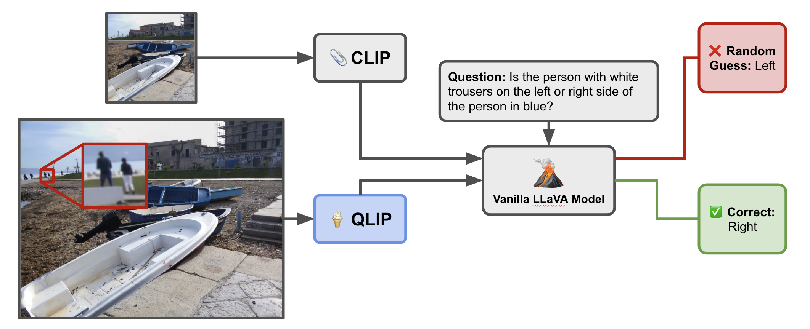

# QLIP: A Dynamic Quadtree Vision Prior Enhances MLLM Performance Without Retraining
**Kyle R. Chickering**, **Bangzhang Li**, **Muhao Chen**

[Paper]()



This is the codebase associated with our paper [**QLIP: A Dynamic Quadtree Vision Prior Enhances MLLM Performance Without Retraining**]() which has been submitted and is under review.

:warning: This GitHub page is currently under construction as we polish our code for public presentation. :warning:

## Installation 
Using miniconda ...
```
conda create -n qlip - ...
```
Once downloaded you can install the `qlip` package by issuing the command
```
pip install -e .
```
which will install `qlip` and all of it's dependencies.

## Reproducing Results from the Paper
To reproduce everything, which is to say training an MLP network from scratch and running all evaluations, run
```
python run_everything.py
```
Note that this requires four GPUs to be avalible for the training. Alternatively, to reproduce our evals using the pre-trained weights, you can run
```
python eval_everything.py --gpus "<gpu_id_1,gpu_id_2,...>"
```
which will run all the evals, fully saturating the avalible GPUs. Finally, for the lightest reproduction you can run the evals only for the best models that we found. This can be done by running
```
python run_best.py --gpus "<gpu_id_1,gpu_id_2,...>"
```